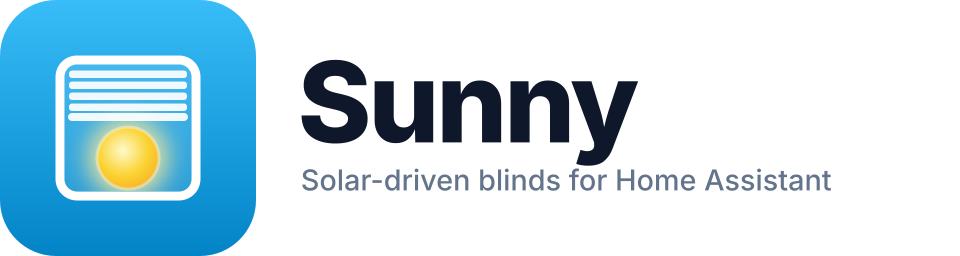
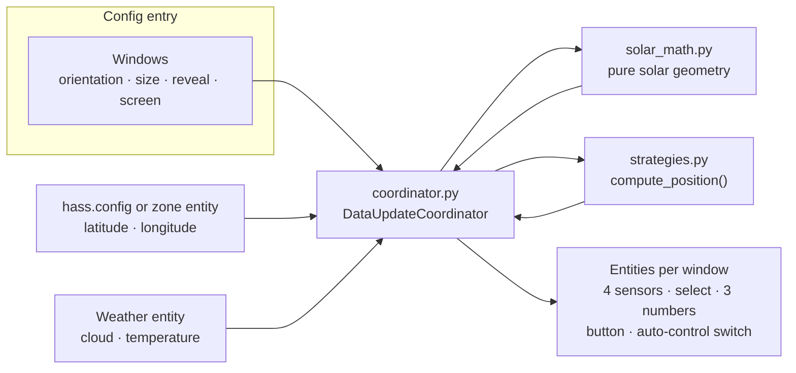
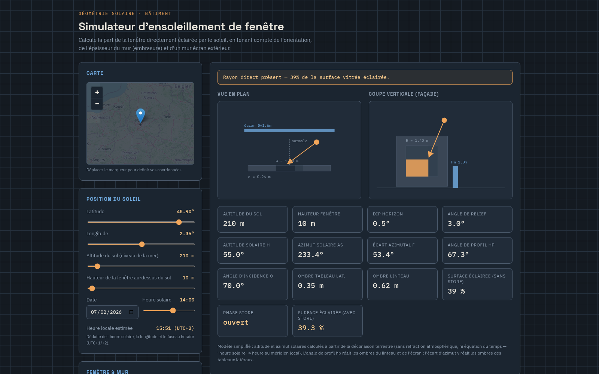

<p align="center">
  <picture>
    <source media="(prefers-color-scheme: dark)" srcset="custom_components/sunny/brand/dark_logo.png">
    
  </picture>
</p>

<p align="center"><em>Solar-driven blind and shutter control for Home Assistant.</em></p>

<p align="center">
  <a href="https://github.com/agravelot/sunny/actions/workflows/validate.yml"></a>
  <a href="https://github.com/hacs/integration"></a>
  
  
  
  <a href="LICENSE.md"></a>
</p>

## Why this project

Blinds are a real trade-off: you want daylight, a view and passive solar gain in winter, yet you also want to keep the summer sun, glare and overheating out. Sunny models the actual **solar geometry** of each window: facade orientation, reveal depth, external obstructions and horizon dip. It then computes how much direct sunlight really lands on the glass and drives each cover with a per-window control strategy.

It is a complete Home Assistant custom integration: a pure-Python calculation core (`solar_math.py`, no Home Assistant imports, 100% unit-tested), seven pluggable strategies, a coordinator that recomputes every window, and full UI configuration through the Config/Options flow.

## Features

- Computes the direct sunlight percentage on a window from the sun position
- Accounts for facade orientation, wall thickness (reveal), external obstructions (screen wall) and building altitude (horizon dip)
- Integrates weather data (cloud coverage, temperature, condition) to enrich the sensors
- Creates 4 sensors per window (sun, desired position, active strategy, cloud coverage) + 1 strategy selector
- 7 configurable control strategies per window
- Settings editable at any time via the Home Assistant Config Flow / Options Flow
- Ships brand icons/logos and is HACS compatible
- 359 unit tests, HACS and hassfest validated on every push

## How it works



The coordinator resolves the geographic position dynamically: if a `zone_entity` is configured it reads the zone's `latitude`/`longitude` attributes, otherwise it falls back to `hass.config`. Sunlight is recomputed for every window on each refresh (every 5 minutes by default, or on demand through the `sunny.refresh` service).

## Installation

### Via HACS (custom repository)

1. In HACS, add a custom repository: `https://github.com/agravelot/sunny` (type: Integration)
2. Install the Sunny integration
3. Restart Home Assistant

### Manual

Copy the `custom_components/sunny` folder into Home Assistant's `custom_components` directory, then restart.

## Configuration

1. **Settings → Devices & Services → Add Integration → Sunny**
2. Select a weather entity (optional) to enrich sensors with temperature and cloud coverage
3. Add one or more windows:

| Parameter | Description | Default |
|-----------|-------------|---------|
| Name | Window name (e.g. Living Room) | required |
| Cover | Associated HA cover entity | required |
| Orientation | Facade azimuth (°, 0=North, 90=East, 180=South, 270=West) | 180 |
| Width | Window width (m) | 1.2 |
| Height | Window height (m) | 1.4 |
| Wall thickness | Reveal depth (m) | 0.25 |
| Screen distance | External obstruction distance (m, 0 = disabled) | 0 |
| Screen height | Obstruction height (m) | 1.0 |
| Altitude | Window height above ground (m) | 10 |
| Ground altitude | Ground / sea level altitude (m) | 208 |
| Tilt threshold | Tilt vs lift threshold (%) | 5 |
| Slat transmission | Light transmission through closed slats (%) | 5 |
| Strategy | Control algorithm | block_all |
| Zone entity | HA zone for geographic position | optional |

4. Sensors are created automatically and update every 5 minutes (configurable).

Parameters can be changed at any time via the **Configure** button on the integration.

## Sensors

Each window produces the following entities:

| Entity | Type | Description |
|--------|------|-------------|
| `{name} Ensoleillement` | `sensor` | Direct sunlight percentage (0-100%) |
| `{name} Position désirée` | `sensor` | Recommended blind position (0-100%) |
| `{name} Stratégie` | `sensor` | Currently active strategy name |
| `{name} Couverture nuageuse` | `sensor` | Cloud coverage (%), if weather configured |
| `{name} Choix stratégie` | `select` | Strategy selector (change strategy from the dashboard) |
| `{name} Position minimale` | `number` | Lower bound for the computed position |
| `{name} Position maximale` | `number` | Upper bound for the computed position |
| `{name} Ensoleillement maximal` | `number` | Target illumination for the lux strategy |
| `{name} Réinitialiser les bornes` | `button` | Resets min/max bounds |
| `{name} Contrôle automatique` | `switch` | Enables automatic cover control |

### Ensoleillement sensor attributes

| Attribute | Description |
|-----------|-------------|
| `solar_altitude` | Solar elevation \( h \) (°) |
| `solar_azimuth` | Solar azimuth \( As \) (°) |
| `gamma` | Azimuth offset (°) |
| `hp` | Profile angle (°) |
| `theta` | Incidence angle (°) |
| `behind` | Sun behind the wall? |
| `d_lat` | Lateral reveal shadow (m) |
| `d_vert` | Lintel reveal shadow (m) |
| `lit_area_m2` | Lit area (m²) |
| `screen_blocks_all` | Screen wall blocking everything? |
| `horizon_dip` | Horizon dip from altitude (°) |

### Position désirée sensor attributes

| Attribute | Description |
|-----------|-------------|
| `cover_entity` | Linked cover entity |
| `tilt_threshold` | Tilt/lift threshold (%) |
| `slat_transmission` | Light transmission through slats (%) |

### Couverture nuageuse sensor attributes

| Attribute | Description |
|-----------|-------------|
| `weather_condition` | Weather state (sunny, cloudy, rainy…) |
| `temperature` | Outside temperature (°C) |

## Control strategies

The strategy determines how `desired_position` is computed. It is chosen per window in the configuration.

| Strategy | Behavior |
|----------|----------|
| **block_all** | Closes enough to block all direct sunlight (summer / heatwave). Position = `100 × y_shadow / Hw`. |
| **winter_passive** | Passive solar heating: open (100%) if sun on window, closed (0%) otherwise. |
| **proportional** | `position = 100 − sunlight%`: more sun → blind goes lower. |
| **threshold** | Closed (0%) if sunlight ≥ 50%, open (100%) if ≤ 20%. Linear interpolation between. |
| **temperature_guard** | If temperature ≥ 28°C and sunlight ≥ 20% → applies block_all. Otherwise open (100%). |
| **privacy_night** | Closed (0%) when sun below horizon, open (100%) during the day. |
| **target_illumination** | Maintains exactly 30% sunlight. Uses a 5% search + binary to find the optimal blind position. |

New strategies can be added in `strategies.py`.

## Automations

Use `desired_position` to control a blind:

```yaml
alias: "Living room blind position"
trigger:
  - platform: state
    entity_id: sensor.salon_position_desiree
action:
  - service: cover.set_cover_position
    target:
      entity_id: cover.living_room_blind
    data:
      position: "{{ state_attr('sensor.salon_position_desiree', 'desired_position') | int }}"
```

Or with a sunlight threshold condition:

```yaml
alias: "Close if high sunlight"
trigger:
  - platform: state
    entity_id: sensor.salon_ensoleillement
condition:
  - condition: numeric_state
    entity_id: sensor.salon_ensoleillement
    above: 40
action:
  - service: cover.set_cover_position
    target:
      entity_id: cover.living_room_blind
    data:
      position: "{{ state_attr('sensor.salon_position_desiree', 'desired_position') | int }}"
```

## Simulator

An interactive simulator is provided in `simulateur_ensoleillement_fenetre.html` (open it directly in a browser):

<p align="center">
  
</p>

- Visualize sunlight on a window in plan and cross-section views
- Test all parameters (orientation, dimensions, screen wall, altitude)
- Connect to Home Assistant to fetch the current sun position
- Place a marker on an OpenStreetMap for geolocation

## Brand assets

The integration icon and logo live in `custom_components/sunny/brand/` (Home Assistant and HACS render them automatically). They are generated from editable SVG sources in `assets/`. Regenerate everything with:

```bash
python3 assets/generate_brand.py    # requires rsvg-convert
```

## Development

```bash
python3 -m pytest tests/ -v         # 359 unit tests
```

Tests do not import Home Assistant: `solar_math.py` and `strategies.py` are pure Python and covered directly.

## References

- `FORMULA.md`: full detail of the solar geometry formulas
- `ui.md`: simulator interface description and known limitations
- `AGENTS.md`: architecture notes and project conventions